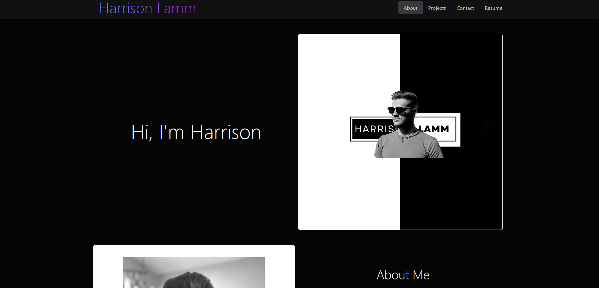

# My React Portfolio

## Description
This application is a react app made to display my portfolio in a responsive, usr-friendly format. It displays my contact info, a collection of some of my work, and my resume.

## Table of Contents

- [Usage](#usage)
- [Installation](#installation)
- [Credits](#credits)
- [License](#license)

## Usage

To see this application in action, visit the deployed site [here](https://lamm9.github.io/reactione-portfolicci/) or clone the rspository to your local machine, and run the `npm i` command, followed by the `npm start` command in the root directory in your terminal.

## Installation

This application is intended to be viewed in the browser via the link above to the deployed site, but if you'd like to install it, it can be cloned to your local machine, and run after having installed the dependencies by running the `npm i` command in the terminal.

## Credits 

[Harrison Lamm](https://github.com/Lamm9)

## License

Please refer to the license in the repo.